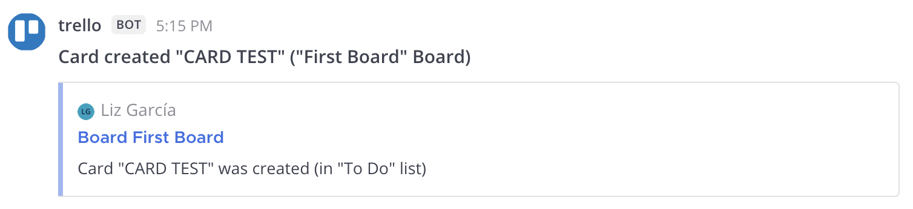
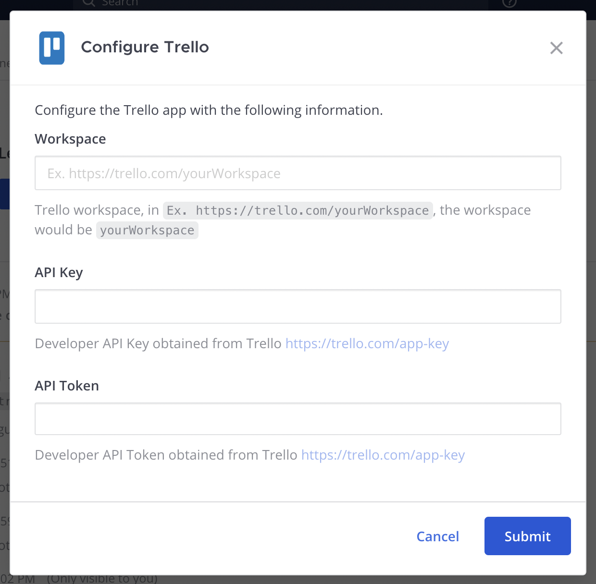
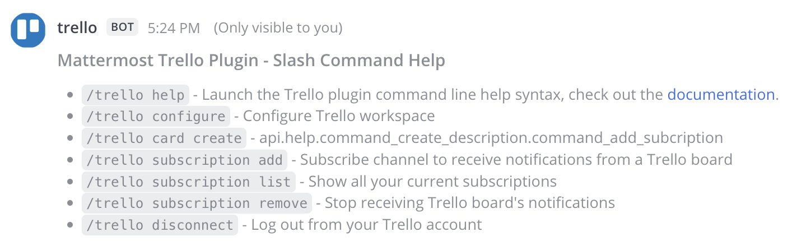
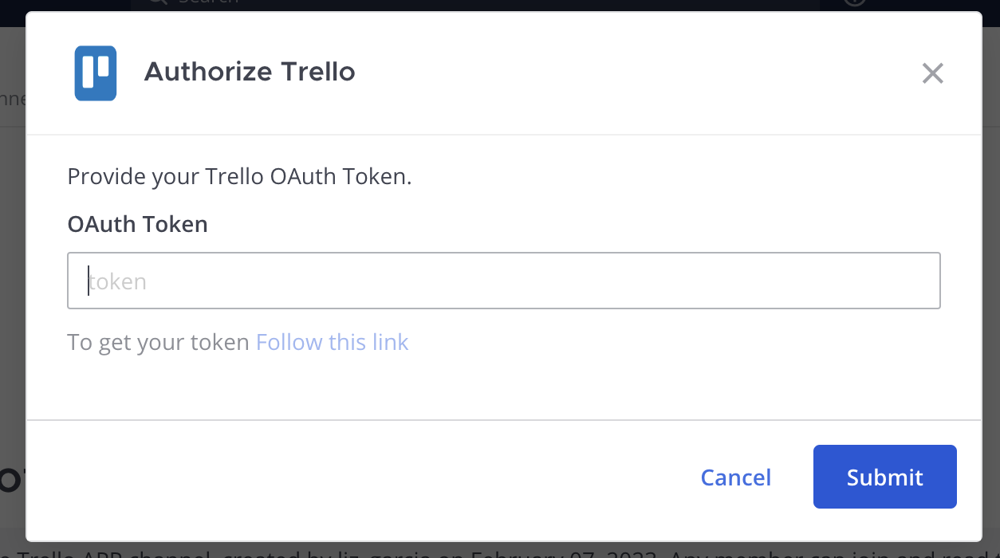
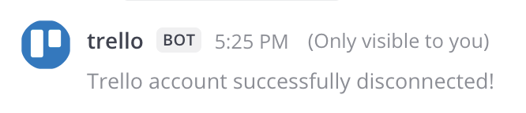
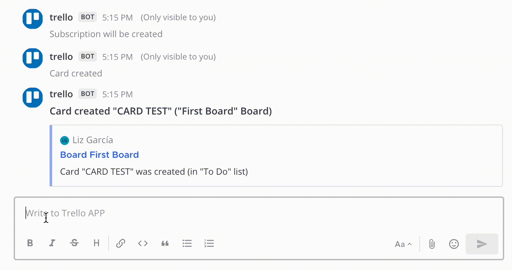
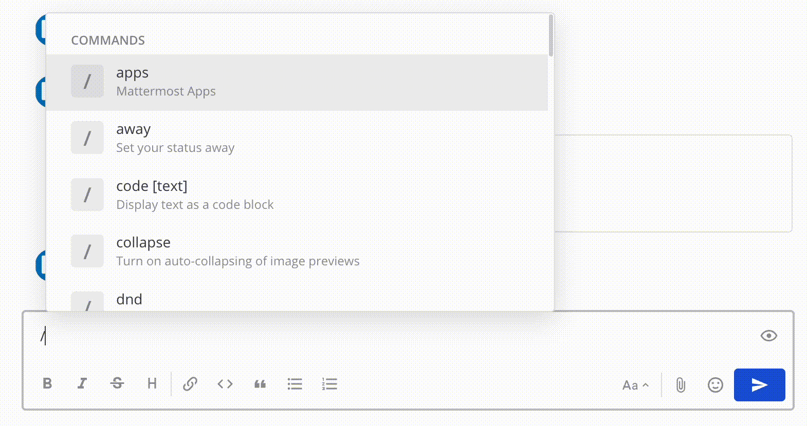

# Mattermost/Trello Integration

* [Feature summary](#feature-summary)
* [Set up](#set-up)
  * [Installation HTTP](#install-with-http)
  * [Installation Mattermost Cloud](#install-on-mattermost-cloud)
  * [Configuration](#configuration)
* [Admin guide](#admin-guide)
  * [Slash commands](#slash-commands)
* [End user guide](#end-user-guide)
  * [Get started](#get-started)
  * [Using /trello commands](#use-trello-commands)
* [Development environment](#development-environment)
  * [Manual installation](#manual-installation)
  * [Install dependencies](#install-dependencies)
  * [Run the local development environment](#run-the-local-development-environment)
  * [Run the local development environment with Docker](#run-the-local-development-environment-with-docker)

This application allows you to integrate Trello with your Mattermost instance to notify you of new and updated cards, as well as allow you to create new cards without leaving Mattermost.

# Feature summary

**Trello to Mattermost notifications:** Link your Mattermost channels with Trello boards to receive notifications about new and updated cards.

**Manage card creation on Mattermost:** Create new cards from Mattermost (via modal or command) and assign them to boards and lists.



# Set up


## Install with HTTP

To install an app with HTTP method, run the command ``/apps install http TRELLO_API`` in any channel. The ``/trello`` command should be available after the configuration has been successfully installed.

The ``TRELLO_API`` should be replaced with the URL where this Trello API instance is running. Example: ``/apps install http https://myapp.com/manifest.json``


## Install on Mattermost Cloud

To install, as a Mattermost system admin user, open the Mattermost Marketplace and select **Install** located next to the Trello app. The ``/trello`` command should be available after the configuration has been successfully installed.


## Configuration

After [installing](#installation) the app:
1. Configure your Trello workspace. As a super admin user, run the ``/trello configure`` command.
2. In the confirmation modal, enter your workspace, API key, and API token which you can find at https://trello.com/app-key.
3. When you've completed the configuration, the ``/trello account`` command will be enabled. 
4. Next, for access to all the commands, log in to a Trello account using the command ``/trello account login``.
5. Follow the link provided and enter the generated token where required.

# Admin guide

## Slash commands

- ``/trello configure``: This command will enable all the other commands; it asks the administrator for an API key (which will be used to execute calls to Trello’s API) and an authorization token.


# End user guide

## Get started

## Use ``/trello`` commands

- ``/trello help``: This command will show all current commands available for this application.



- ``/trello connect``: Prompt for a Trello authorization token. You must run this slash command first before attempting to run other slash commands available for this integration.



- ``/trello disconnect``: Delete the current user authorization token.



- ``/trello card create``: Create a new card in any Trello board. Can be run through a product modal or from a terminal as a command.


- ``/trello subscription add``: Create a new subscription for notifications by choosing a board and a channel for notifications. You can subscribe to more than one board per channel.



- ``/trello subscription list``: Show the list of all subscriptions made in all of your channels.



- ``/trello subscription remove``: Remove a subscription to stop receiving notifications from that board.


# Development environment

## Manual installation

*  Download the latest repository release in [mattermost-app-trello](https://github.com/mattermost/mattermost-app-trello).

### Run the local development environment

* You need to have at least Node version 15 and maximum version 18 installed. You can download the latest LTS version of Node for your operating system here: https://nodejs.org/es/download/

### Install dependencies
* Move to the project directory or execute ``cd`` command to the project directory and execute ``npm install`` with a terminal to download all dependency libraries.

```
$ npm install
```

*  Update the environment configuration file. The ``.env`` file must be modified or added to set the environment variables, it must be in the root of the repository.

```
file: .env

PORT=4005
HOST=http://localhost:4005
```

Variable definition

- PORT: The port number the OpsGenie integration is listening to.
- HOST: The Trello API usage URL.

* Finally, the project must be executed by running the following command:

```
$ npm run dev
```

Or, you can use the Makefile command:

```
$ make watch
```

### Run the local development environment with Docker

* You need to have Docker installed. You can find the necessary steps to install Docker for the following operating systems:

- [Ubuntu](https://docs.docker.com/engine/install/ubuntu/)
- [Mac](https://docs.docker.com/desktop/mac/install/)
- [Windows](https://docs.docker.com/desktop/windows/install/)

* Once you have Docker installed, run the ``make run`` command to create the API container and expose it locally or on the server, depending on the case required.

```
$ make run
```

When the container is created correctly, the API runs at ``http://127.0.0.1:4005``. If Mattermost is running on the same machine, run the following slash command in Mattermost to install the app:

```
/apps install http http://127.0.0.1:4005
```

To stop the container, run the following command:

```
$ make stop
```
