##Mattermost/Trello Integration
This application allows you to integrate Trello to your Mattermost instance, letting you know when a new card is created, as well as getting notified about card updates.
Also, allows the user to create new cards without moving from the Mattermost window.

##Feature Summary
###Trello to Mattermost Notifications
Link your Mattermost channels with the Trello boards you want to see, so you and your team can get notifications about the creation and position update of each card.

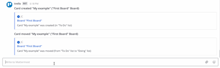

##Manage card creation on Mattermost
Create new cards from Mattermost (via modal or command), assigning the board and the list to which you want to add the card.

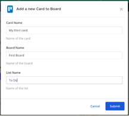


##Installation
### Requirement
•	Mattermost instance with the /apps install command enabled. 

### Manual Installation
To install, as a super admin user role, execute command /apps install http TRELLO_API_URL in any channel. Trello command should be available after the configuration has been successfully installed.
TRELLO_API_URL should be replaced with the URL where the Trello API instance is running.
Example:
```
/apps install http https://mattermost-trello-dev.ancient.mx/manifest.json
```

##Configuration
###Step 1: Install the application in Mattermost
Firstly, you need to install the app in your current Mattermost instance (refer to Installation), the /trello command should be available.

###Step 2: Configure Trello workspace
As a super admin role user, execute /trello configure command, which will open a modal were workspace, API key and API token will be asked (https://trello.com/app-key).

###Step 3: Login as a Trello user
After configuration has been stablished, command /trello account will be enabled. To be able to access to all commands, you should login to a Trello account and follow the link provided after /trello account login is executed, then, paste in the modal the generated token.

##User Slash Commands
Mattermost system user (Administrator)
/trello configure:  This command will enable all the other commands; it asks the administrator for an API key (which will be used to execute calls to Trello’s API) and a token.

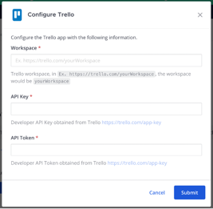

##Mattermost user
/trello help: This command will show all current commands available for this application.

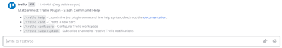

/trello account login: Will display a new modal were a user token will be needed. It is required before any other action.

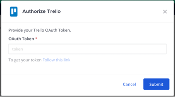
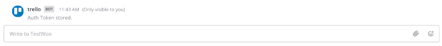

/trello account logout: Will erase current user oauth token.

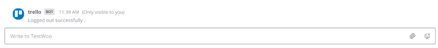

/trello card create: Allow any user to create a new card in any board they want (boards are listed as they have access to them from Trello). Both, command and modal options are available.

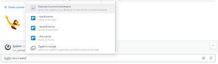


/trello subscription add: Creates a new subscription for notifications: choose a board and a channel and get notified of the updates in that board. You can subscribe more than one board per channel.

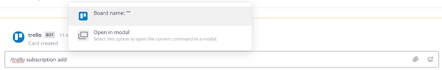
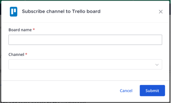


/trello subscription list: Show the list of all subscriptions made in all of your channels.

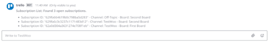

/trello subscription remove: Will allow you to remove a subscription. No more notifications from that board will be received.

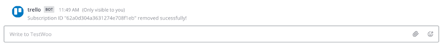
